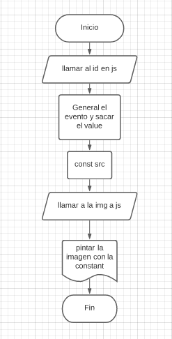

## Pseudocódigo sección URL de la imagen

### ¿Cómo logramos que al poner la url en el input se pinte la imagen en el contenedor correspondiente?

- Inicio 
- Tener identificado el de donde sacaremos el link (llamar al id)
- Identificar cuando el usuario ingrese el link
- Guardar el link que ingresó el usuario
- Identificar el lugar donde se pintara la imagen 
- Agregarle el link como atributo 
- Fin 

